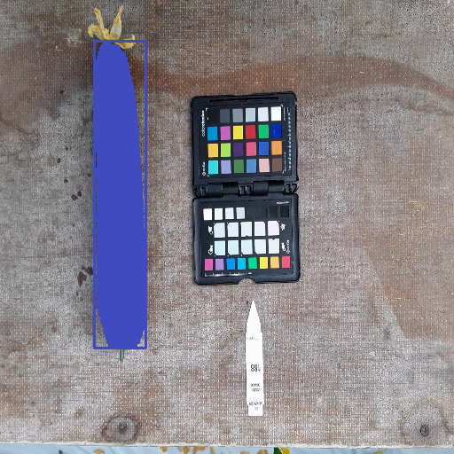
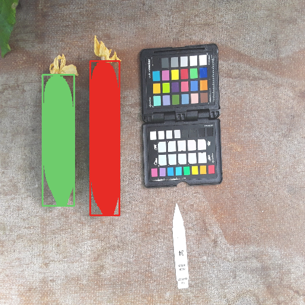
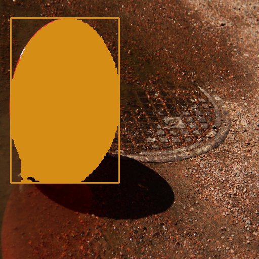
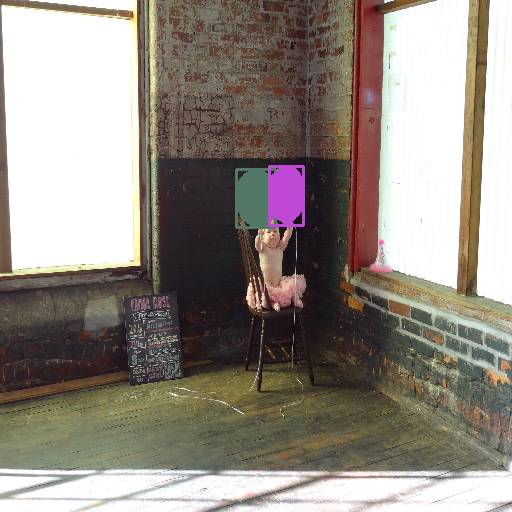

# Nano-Instance-Segmentor

Nano-Instance-Segmentor is an extension of [NanoDet](https://github.com/RangiLyu/nanodet), an efficient, lightweight object detection model, that now includes instance segmentation capabilities. This project aims to provide a high-performance yet resource-efficient solution for both object detection and instance segmentation.

## Highlights of Nano-Instance-Segmentor:

- 🚀 A lightweight segmentation branch added to the original detector, enabling instance segmentation.
- ✔️ Evaluation tools for instance segmentation have been included.
- 🌐 Exported models for ONNX and OpenVINO formats.
- 🛠️ ONNX and OpenVINO formats support NMS layers.
- ⏱️ High performance in terms of inference speed:
    - ONNX model in ONNX Runtime/CPU: 0.033 seconds per image, FPS: 30.45 (Model size: 5MB)
    - ONNX model in OpenVINO Runtime/CPU: 0.023 seconds per image, FPS: 43.65 (Model size: 5MB)
    - OpenVINO IR model in OpenVINO Runtime/CPU: 0.021 seconds per image, FPS: 47.92 (Model size: 6MB)


## Qualitative Results

Visual results for nano instance segmentor for veg and balloon dataset

#### Cucumber Results
<table>
  <tr>
    <td align="center"></td>
    <td align="center"></td>
  </tr>
</table>

#### Balloon Results
<table>
  <tr>
    <td align="center"></td>
    <td align="center"></td>
  </tr>
</table>


## Getting Started

These instructions will get you a copy of the project up and running on your local machine for development and testing purposes.

### Prerequisites

- Python 3.6 or later
- ONNX Runtime 1.8.0 or later
- OpenVINO Toolkit 2022.1 or later

### Installation

1. Clone the Nano-Instance-Segmentor repository:

```bash
git clone https://github.com/yourgithubusername/Nano-Instance-Segmentor.git
cd Nano-Instance-Segmentor
pip install -r requirements.txt
```

2. Install required packages

```bash
pip install -r requirements.txt
```

3. Convert to ONNX and OpenVino
```
# For ONNX conversion
python scripts/onnx_conversion.py

# For OpenVINO conversion
python scripts/onnx_to_openvino.py
```


## Credits

This project was inspired and largely based on the work of [NanoDet](https://github.com/RangiLyu/nanodet). A huge thanks to the creators for the initial foundation.
